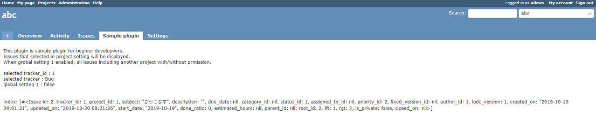
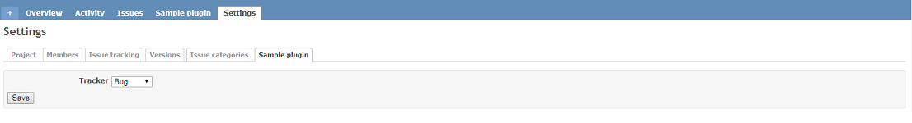

# redmine_empty_plugin
This is a sample plugin for beginner developers.

## Features
* Project module and project setting tab
* Load global setting and project setting
* Index page
* Redmine 4.x and 3.x compatible

# Screenshots
#### Overview

# Installation notes

## Install

1. go to plugins folder
<pre>
git clone https://github.com/aki360P/redmine_empty_plugin.git
</pre>
2. bundle install (skip option see below)
<pre>
bundle install
</pre>
3. migration
<pre>
rake redmine:plugins:migrate NAME=redmine_empty_plugin RAILS_ENV=production
</pre>
3. restart server

### How to skip bundle install

* delete Gemfile in ./plugins/redmine_empty_plugin
* change source code 00x_XxxxXxxxx.rb in ./plugins/redmine_empty_plugin/db/migrate.
 First line needs to be changed according to your rails version
<pre>
 class CreateTable < ActiveRecord::CompatibleLegacyMigration.migration_class
  #for redmine 3x,  class CreateTable < ActiveRecord::Migration
  #for redmine 4x,  class CreateTable < ActiveRecord::Migration[4.2]
</pre>

## UnInstall

<pre>
rake redmine:plugins:migrate NAME=redmine_empty_plugin VERSION=0 RAILS_ENV=production
</pre>
